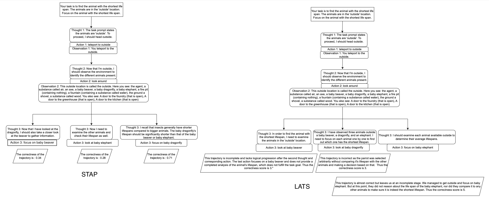

# Planning_With_LLM
This repository contains the code for Sequential Thought-Action Planner (STAP). 

# Scienceworld
All the prompts are in scworld.py.
md 
 `react_sc_ao.py` - a react example
 `react_scieceworld.py` - react implemented in scienceworld use python command to run 
 Set `randVariationIdx = env.get_random_variation_test()` for getting results in scienceworld test environment.
 Whereas to generate data for finetuning LLM set `randVariationIdx = env.get_random_variation_train()`

To finetune a model for scoring

data_extraction.ipynb - Will take the log files saved by generating trained samples from react and convert into a dataframe of taskdescription, observation, thought, action, score

fine_tune.py - finetune any model
 `fine_tune_llama.py` - finetune llama-7b in bf16
 `inference.py` - just to load and check if the model is setup for inference can run using python command

`scworld.py` - contains prompts for scienceworld trajectory scoring
 `scworld_task.py` - contains various wrappers to for prompt wrapping and scoring (Also contains the  finetune trained model to score state-actions)(If you want to change the finetune model to ollama-3b or llama-7b) refer to this file.

`mcts_sc_rollout.py` - contains implementation of lats with llm scoring for scienceworld
 `mcts_llama_sc_rollout.py` - contains implementation of lats with evaluation of our finetuned state-action reward model

To implement lats for sciencewolrd run `python hotpot_qa/run_mcts_sc.py --num-episodes=10 --simplifications-preset easy` in Planning_with_LLM folder make sure of the following in `run_mcts_sc.py` : 
 `state,value,all_nodes,reward, score=mcts_sc_search(args,env,task,randVariationIdx,taskName,simplificationStr,logger2)` for llm scoring

`state,value,all_nodes,reward, score=mcts_llama_sc_search(args,env,task,randVariationIdx,taskName,simplificationStr,logger2)` for llm scoring

# Hotpot QA
Methods implemented
 To implement the below techniques in wrappers.py set `DATA_DIR = "hotpot_qa/data"`
 cot - `hotpot_qa/cot_hotpot_qa.py` run using python command
 react - `hotpot_qa/react_hotpot_qa.py`
 react + cot - `hotpot_qa/react_cot_hotpot_qa.py`

For the other methods set `DATA_DIR = "data"` and inside the hotpot_qa directory
 LATS (Language Augmented Tree Search) - `sh lats.sh`
 RAP (Reasoning via Planning) - `sh rap.sh`
 ToT (Tree of Thoughts) - `sh tot.sh`

All these methods are called in `run.py` file with algorithm name in each of the sh file specifying which one would run.

Dependency files
 `hotpot.py` - few shot prompts for lats trajectory scoring and thought action generation via llms
 `hotpot_qa.py` - contains wrappers around the prompts 
 `models_custom.py` - GPT-4 firefall setup is called wherever there is a requirement to generate a prompt 
 `wikienv.py` - wiki environment for hotpot QA dataset

`performance_analysis.ipynb` - Run this to do umap (Unifrom Manifold Projection and Approximation) on the log files for hotpotQA methods just check the log file directory set it to the right path will generate plots based on f1 score for questions and answers to questions.

 

